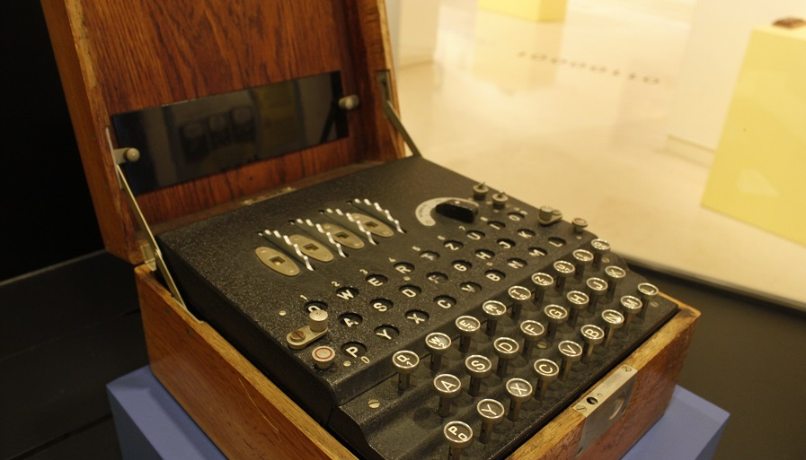

<h2 align="center">  Artificial Intelligence (AI)  🤖 </h2>
<!-- https://shields.io/ -->

  
  </a>
    
  </a>
  
  
    
  </a>
  </a>
    
  </a>
  </a>
    
  </a>
  </a>
    
  
  

<table align="center">
  <tr>
    <td align="center" style="padding=0;width=50%;">
      
    </td>
  </tr>
</table>

## Table of Contents

| Numeration   | Check       | Sticker        |    Topic      |   Quantization   |    Edit Gitpot    |    Downloads    |  link  |
| ------------ |-------------|-------------- |----------------- |------------------ |---------------- |-------------- |------------- |
|  001   |:heavy_check_mark: | | [Historia](#Historia)   | 🧠 | 💻 | 💾 | [ ⬅️ back](https://github.com/BrianMarquez3)| 

----

 ## Historia

Cuando pensamos en inteligencia artificial es habitual pensar en una secuencia de imágenes futuristas en las que participa tecnología de última generación. Sin embargo, para que haya llegado hasta el punto donde se encuentra actualmente, ha tenido que afrontar diversos retos a lo largo de la historia. Te proponemos un recorrido por los acontecimientos más puntuales que giran en torno a la IA desde su nacimiento hasta la actualidad.

### Origen y evolución cronológica

El origen de la inteligencia artificial es muy antiguo. Se remonta al 300 a.C. y aunque, por aquel entonces era impensable pensar en un concepto de tal magnitud, los siguientes hechos de la historia tuvieron un peso importante en su desarrollo.

Aristóteles fue el primero en descubrir de manera estructurada un conjunto de reglas, los llamados silogismos, que describen una parte del funcionamiento de la mente humana y que, al seguirlas paso a paso, producen conclusiones racionales a partir de las premisas.

En el 250 a.C., Ctesibio de Alejandría construyó la primera máquina autocontrolada. Se trataba de un regulador del agua que modificaba su propio funcionamiento, pero sin un razonamiento previo.

En 1637, uno de los filósofos más influyentes del siglo XVII predijo la posibilidad de crear máquinas que pensasen por sí mismas. Esta figura se trataba de René Descartes.

Después de años de parón en este sentido, en 1847, el matemático George Boole puso un componente más a esta historia, estableciendo que el razonamiento lógico podría sistematizarse, de igual forma que se resuelve una ecuación matemática.

30 años más tarde, Gottlob Frege a partir de los estudios de Boole obtiene la Lógica de Primer Orden, la cual contaba con mayor énfasis y una mejor expresión. Actualmente se sigue tomando como referencia.

_Alan Turing_

<table align="center">
  <tr>
    <td align="center" style="padding=0;width=50%;">
      
      <h4 align="center">  Matemático, lógico, informático teórico, criptógrafo, filósofo, biólogo teórico, inteligencia artificial, maratoniano y corredor de ultradistancia británico <h4>
    </td>
  </tr>
</table>

La inteligencia artificial no sería lo que es sin la tecnología y, no hay nada más futurista que los robots. La primera vez que se acuñó la esta disruptora palabra fue en el año 1921 por Karel Čapek en su obra de teatro R.U.R.

Siguiendo este hilo, en 1936 entra en juego el que hoy en día se considera como uno de los padres de la tecnología de la información, Allan Turing. Este matemático introdujo el concepto de algoritmo a través de su artículo “Computing machinery and intelligence” mediante el cual sentó las bases de la informática moderna.

A través del cual, surge el conocido Test de Turing, una prueba de comunicación verbal hombre máquina que evalúa la capacidad de la tecnología de hacerse pasar por los seres humanos.

5 años más tarde (1941), se crea el primer ordenador de la historia moderna, un dispositivo programable y automático, el cual fue bautizado como Z3. El mérito de este invento se le atribuye a Konrad Zuse.

Ese mismo año, con una mayor innovación, eficiencia y cada vez más cerca de la inteligencia artificial, Isaac Asimov, en su escrito de ciencia ficción “Círculo Vicioso” argumenta las leyes de la robótica, aquellas que todo robot debe cumplir. Estas son:

_>Los robots no podrán dañar al ser humano._  
_>Los robots cumplirán las órdenes designadas._  
_>Los robots protegerán su propia existencia siempre y cuando ésta no entre en conflicto con la primera o segunda ley antes propuestas._ 

<table align="center">
  <tr>
    <td align="center" style="padding=0;width=50%;">
      <h4 align="center"> Máquina de Turing<h4>
      
    </td>
  </tr>
</table>

En 1943, Warren McCulloch y Walter Pitts presentaron su modelo de neuronas artificiales, el cual se considera el primer trabajo del campo de inteligencia artificial, aunque aún no había sido acuñado como tal.

Estos científicos partieron de tres fuentes principales: conocimientos sobre la fisiología básica y funcionamiento de las neuronas en el cerebro, el análisis formal de la lógica preposicional de Russell y Whitehead y la teoría   de Allan TurinG

## Books

<table>

  <tr>
      <td>Name</td>
      <td>Authors</td>
      <td>Editor</td>
      <td>Edition</td>
      <td>Link</td>
      <td>Password</td>
  </tr>

  </tr>

</table>

## Paypal Donation
🩸 Hacer una donación [PAYPAL](https://www.paypal.com/donate?hosted_button_id=98U3T62494H9Y) 🍵

## License 
Todo acerca de la licencia [here](https://github.com/BrianMarquez3/Learning-Git/blob/master/LICENCE)

 <table align="center">
    <tr>
      <td colspan="3">A</td>
        <td>B</td>
      </tr>
      <tr>
        <td>C</td>
      <td colspan="2"></td>
        <td>E</td>
      </tr>
      <tr>
      <td colspan="3">F</td>
        <td>G</td>
    </tr>
</table>

